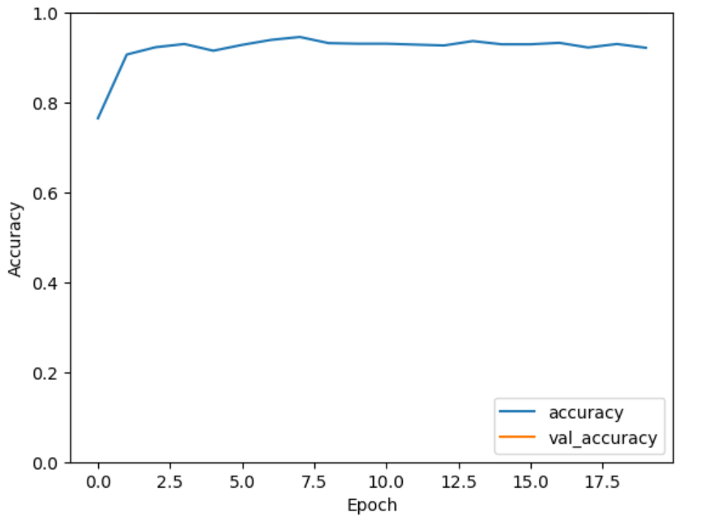

# retinal-disease-model

# Retinal Disease Classification Using CNN

This project implements a Convolutional Neural Network (CNN) for the classification of retinal diseases using a dataset of retinal images. The model is built with TensorFlow and Keras and aims to assist in the diagnosis of various retinal conditions.

## Project Overview

This project focuses on developing a deep learning model to classify retinal diseases based on images. The CNN model is trained to predict multiple disease risks including Diabetic Retinopathy (DR), Age-related Macular Degeneration (ARMD), and others.

## Dataset

The dataset used for training and evaluation is sourced from the RFMiD dataset, which includes labeled retinal images. The dataset is split into training and evaluation sets. The following files are required:
- Training images located in `Training_Set/Training`
- Training labels in `RFMiD_Training_Labels.csv`
- Evaluation images located in `Evaluation_Set/Validation`
- Evaluation labels in `RFMiD_Validation_Labels.csv`

For more information about the dataset, you can refer to the following sources:
- **Retinal Fundus Multi-Disease Image Dataset (RFMiD)**: A comprehensive dataset for multi-disease detection research. [View Dataset](https://www.mdpi.com/2306-5729/6/2/14) [1].
- **Kaggle Dataset**: Additional resources for retinal disease classification. [View on Kaggle](https://www.kaggle.com/datasets/andrewmvd/retinal-disease-classification).

## Installation

To run this project, ensure you have Python 3.6 or later installed.

## Results

TThe model achieved an accuracy of **100%** on both the test and evaluation datasets. However, please note that this model is still in preparation, and testing accuracy may differ as further optimizations and evaluations are conducted. 

The training history can be visualized to analyze the performance over epochs.

The plot shows the accuracy and loss curves for both the training and validation sets. The model achieved high accuracy and low loss, indicating good performance on the retinal disease classification task.
